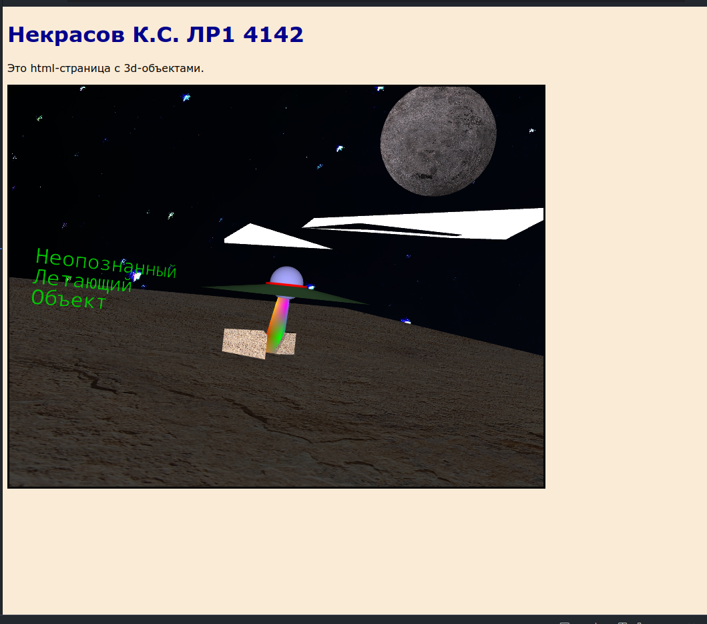

# Вариант 14

## Цель работы

Целью работы является ознакомлилсяс принципами использования
геометрических объектов для построения X3D-сцен. Ознакомление с узлами
пространственных преобразований, группировки и тиражирования объектов
X3D-сцены, создания гиперссылок и задания свойств материалов и текстур
геометрических объектов, а также принципами создания HTML-страниц с
внедренным X3D-кодом.

## Задание варианта

Простые геометрические узлы:

1. Sphere
2. Plane
3. Text
4. Pyramid
5. Snout
6. Transform
7. Shape

Сложные геометрические узлы:

1. IndexedTriangleStripSet
2. Extrusion

Группирование и встраивание:

1. DEF/USE
2. Group
3. Anchor

Текстурирование:

1. Appearance
2. Material
3. PixelTexture

## Код страницы

```html
<!DOCTYPE html>
<html lang="ru">

<head>
	<meta charset="utf-8" />
	<title> Lab1 X3DOM </title>
	<script src="https://www.x3dom.org/download/dev/x3dom-full.js"></script>
	<link rel='stylesheet' type='text/css' href='https://www.x3dom.org/download/x3dom.css'>
	<style>
		x3d {
			border: 3px solid #050505;
			background-image: url('background.jpg');
		}

		body {
			font-size: 100%;
			font-family: verdana, sans-serif;
			background-color: antiquewhite;
			color: black;
		}

		h1 {
			color: darkblue;
		}
	</style>
</head>

<body>
	<h1> Некрасов К.С. ЛP1 4142 </h1>
	<p>
		Это html-страница c 3d-объектами.
	</p>
	<x3d width='800px' height='600px'>
		<scene>
			<!--table-->
			<transform rotation='1,0,0, -1.5'>
				<shape>
					<appearance>
						<Texture DEF='sand_texture' url="sand.jpg"></Texture>
						<material DEF='sand_color' diffuseColor='1 0.643 0.1'></material>
						<material diffuseColor='0 1 0'></material>
					</appearance>
					<plane size='50 50'></plane>
				</shape>
			</transform>

			<!--snout-->
			<transform translation="-0.3 1.5 -0.2">
				<shape>
					<appearance>
						<PixelTexture image="3 2 3 
    0xFF0000 0x00FF00 0x0000FF 
    0xFFFF00 0xFF00FF 0x00FFFF" />
					</appearance>
					<snout height="3"></snout>
				</shape>
			</transform>

			<!--moon-->
			<transform translation="15 15 -5">
				<shape>
					<appearance>
						<imagetexture DEF='steel_texture' url="steel.jpg"></imagetexture>
					</appearance>
					<sphere radius="4"></sphere>
				</shape>
			</transform>

			<Group DEF="clouds">
				<transform translate="0 0 0">
					<Shape>
						<IndexedTriangleStripSet ccw='true' colorPerVertex='false' index='0 1 2 3 4 5 0' normalPerVertex='true'
							solid='false' containerField='geometry'>
							<Coordinate point='0.5 6 0 2 6 3 5 6 5 6 6 7 1 6 12 -1 6 3' />
							<Color color="0 0 1" />
						</IndexedTriangleStripSet>
					</Shape>
				</transform>
				<transform translate="0 0 0">
					<Shape>
						<IndexedTriangleStripSet ccw='true' colorPerVertex='false' index='0 1 2 3 4 5 0' normalPerVertex='true'
							solid='false' containerField='geometry'>
							<Coordinate point='-3 5 -1  -2 5 -3  -5 5 5  1 5 2  0 5 2  -1 5 3' />
							<Color color="0 0 1" />
						</IndexedTriangleStripSet>
					</Shape>
				</transform>

			</Group>


			<Transform translation='-2'>
				<Shape>
					<Appearance>
						<Material USE="sand_texture" />
					</Appearance>
					<Extrusion crossSection='-1 0 0 2 1 0 -1 0' solid='false'>
						<!-- spine is open, crossSection is closed here!!! -->
					</Extrusion>
				</Shape>
			</Transform>

			<!--pyramid-->
			<transform translation='0 .5 0'>
				<shape>
					<appearance>
						<imagetexture USE='sand_texture'></imagetexture>
						<material USE='sand_color'></material>
					</appearance>
					<pyramid></pyramid>
				</shape>
			</transform>

			<!--UFO-->
			<transform translation="0 3 0">
				<Inline url="ufo.x3d" />
			</transform>

			<transform translation="-10 3 -7">
				<Anchor url='"./ufo.x3d"'>
					<shape isPickable='true'>
						<Text string='"Неопознанный" - "Летающий" - "Объект"' solid='false'>
							<FontStyle family="MONOSPACE" size='1' spacing='1' language='ru'></FontStyle>
						</Text>
						<Appearance>
							<Material diffuseColor='0 0.7 0'></Material>
						</Appearance>
					</shape>
				</Anchor>
			</transform>

		</scene>
	</x3d>
</body>

</html>
```

## Код инлайна ufo.x3d

```html
<X3D profile="Full" version="3.2" xmlns:xsd="http://www.w3.org/2001/XMLSchema-instance" xsd:noNamespaceSchemaLocation="http://www.web3d.org/specifications/x3d-3.2.xsd">
  <Scene>
    <Transform translation="0 0.3 0">
      <Shape>
        <Appearance>
          <Material diffuseColor="0.4 0.4 1"/>
        </Appearance>
        <Sphere radius=".8"/>
      </Shape>
    </Transform>
    <Transform>
      <Shape>
        <Appearance>
          <Material diffuseColor="1 0 0" />
        </Appearance>
        <Cylinder height="0.5" radius="1"/>
      </Shape>
    </Transform>
    <Transform>
      <Shape>
        <Appearance>
          <Material diffuseColor='0.1 0.3 0.1' />
        </Appearance>
        <Cone bottomRadius="4" height="0.6"/>
      </Shape>
    </Transform>
  </Scene>
</X3D>
```

## Скриншот результата



## Вывод

В результате выполнения лабораторной работы я ознакомился с принципами использования геометрических объектов для построения X3D-сцен. Ознакомился с узлами пространственных преобразований, группировки и тиражирования объектов X3D-сцены, создания гиперссылок и задания свойств материалов и текстур геометрических объектов, а также принципами создания HTML-страниц с внедренным X3D-кодом.
