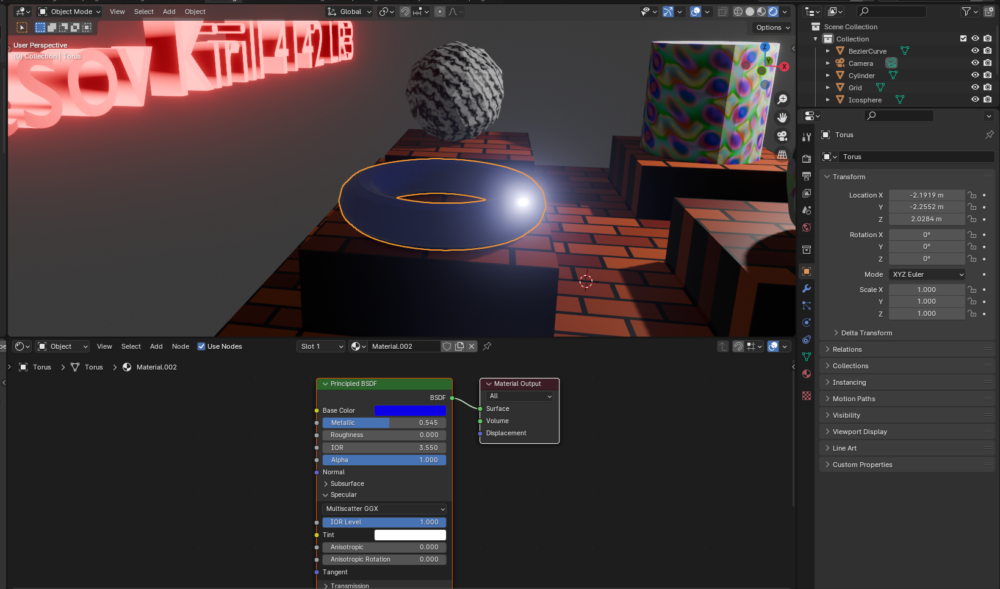
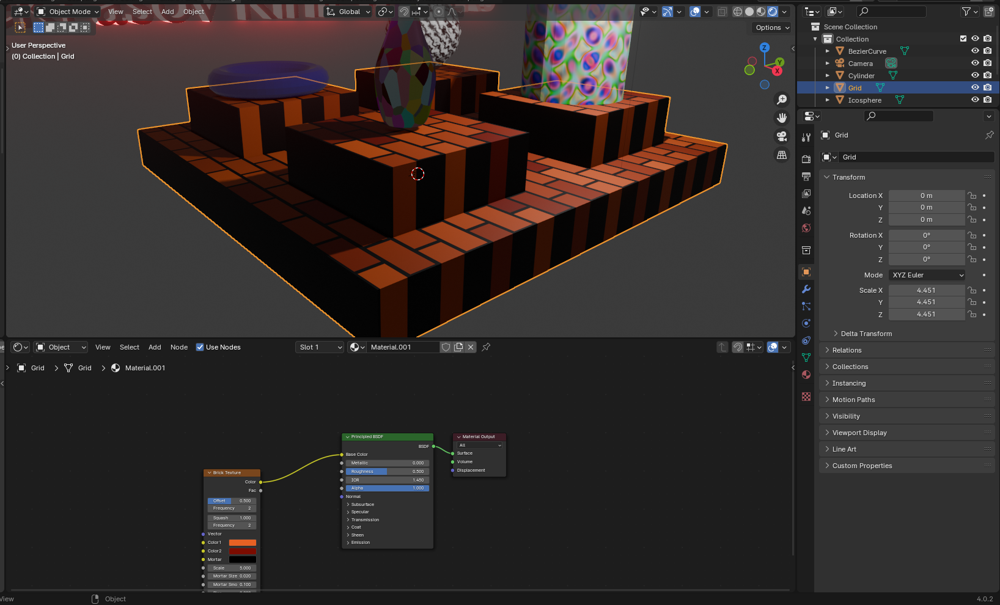

# Вариант 14

## Цель работы

Целью  работы  является  ознакомление  с  интерфейсом  редактора  Blender и принципами  моделирования  геометрических  объектов,  для  построения  3D-сцен. Настройка материалов и текстурирование объектов. Изучение базовых принципов анимации, работа с камерой и визуализация сцены в редакторе Blender.

## Индивидуальное задание

### Геометрические объекты(Mesh)

- Cylinder
- Torus
- Ico Sphere
- Grid

### Тела выдавливания и/или вращения 

- Ваза
- 3D текст

## Изображения геометрических объектов и их основные параметры

## Инструменты Blender, применяемые для построения геометрических объектов

Основание было создано при помощи размещения сетки (Grid) и вытягивания сетки инструментом Extrude. 
Пъедесталы также были вытянуты из поверхности сетки.

Ваза была создана из Bezier Curve, к которой был применён модификатор Screw, после чего полученная фигура была конвертирована в меш, а для создания объема стенок внутренняя поверхность вазы была вытянута и сжата при помощи горячей клавиши s.

## Инструменты  Blender,  примененные  для  текстурирования 

Для вазы был использован Voronoi Texture, применённый к Glass BSDF шейдеру

Для основания был использован Brick Texture со стандартным шейдером.

К тору был применён стандартный шейдер с синим цветом

К ICO сфере была применена Wave Texture со стандартным шейдером

С цилиндром была использована Magic Texture

Для 3D текста был использован Emission Shader, смешанный со стандартным шейдером, для создания эффекта свечения

## Инструменты  Blender,  применяемые  для  создания  анимации геометрических объектов

Для всех геометрических объектов был использован Auto keying, отмечая, какие свойства объекта должны быть анимированы, изменяя их, двигая вместе с тем маркер времени по временной шкале.

## Инструменты  Blender,  применяемые  для  создания  анимации движения камеры по сплайну

Для анимации камеры был создан BezierCircle увеличенный и размещённый над сценой

Чтобы камера следовала этому пути к ней был применены Object Constraint'ы Follow Path с полем Target, установленным на BezierCircle и TrackTo с полем тарген установленным на Grid (основание)

## Результаты визуализации

## Имя и объем 3D сцены в формате *.blend

3D сцена с именем project.blend имеет объем 1.4Мб.

## Объём и формат видеофайла анимации объектов и камеры

Видеофайл имеет имя 0001-0250.avi и объем 28.3Мб

## Имя и объем в Кб файла в формате FBX

Файл сцены в фомате FBX имеет имя project.fbx и объем 309.7Кб

## Выводы

Произведено ознакомление  с  интерфейсом  редактора  Blender и принципами  моделирования  геометрических  объектов,  для  построения  3D-сцен. Освоена настройка материалов и текстурирование объектов. Изучены базовые принципов анимации, работа с камерой и визуализация сцены в редакторе Blender.

## Использованная литература

1. Make Camera Follow Path in Blender Easy [Электронный ресурс] URL: https://www.youtube.com/watch?v=0N8ucYi_eOM (дата обращения 11.02.2024)
2. Blender 3D: How to Set Camera to Current View [Электронный ресурс] URL: https://brandonsdrawings.com/blender-3d-how-to-set-camera-to-view/ (дата обращения 11.02.2024)
3. How to Glow Objects | Blender Beginner Tutorial[Электронный ресурс] URL: https://www.youtube.com/watch?v=WTFj9B6eFgk (дата обращения 11.02.2024)