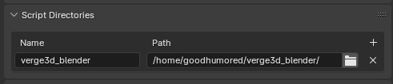

# Вариант: 14

# Цель работы

Ознакомление с основными принципами работы фрейворка Verge3D. Создание интерактивной 3D сцены с использованием Verge3D в форме Web-приложения. 

# Описание установки Verge3D в Blender;

Был загружен архив с официального сайта https://www.soft8soft.com/get-verge3d/ 

 

Затем архив был распакован в домашнюю директорию

Директория была добавлена в блендер в настройках

После чего был активирован аддон

# Создание собственного приложения с помощью дисппетчера приложений App Manager, анализ и описание структуры приложения

Через App Manager было создано приложение с именем Lr 4

В стандартном приложении присутствуют различные файлы сгенерированные Verge3D, такие как среда выполнения Verge3D **v3d.js**, папка **media** для изображений, файлы сцены **environment.hdr**, **lr_4.bend**, **lr_4.gltf**, **lr_4.bin**, файлы для страницы проекта **lr_4.html**, **lr_4.css** и **lr_4.js**, файлы для Verge3D Puzzle **visual_logic.js** и **visual_logic.xml**, а также некоторые другие файлы.

Затем проект лабораторной №3 был отредактирован и залит вместо стандартного, а также экспортирован gltf файл.

# Скриншоты визуализации (рендеринга) статичного кадра (ЛР No3) в Blender и в браузере - Verge3D Web Interactive. Анализ качества преобразования геометрии, материалов и теней при визуализации в Web-браузере.

Видно, что остались анимации, связанные с перемещениями объектов, но пропали эффекты свечения, пропали анимации материалов и модификаторов и сломалась текстура цилиндра, качество изображения в целом тоже стало хуже.

После изменения настроек изменений, за исключением более мягких теней, замечено не было.

# Описание инструментов создания анимации (Animation > Timeline)  перемещения объектов в пространстве сцены

Для всех геометрических объектов был использован Auto keying, отмечая, какие свойства объекта должны быть анимированы, изменяя их, двигая вместе с тем маркер времени по временной шкале.

# Описание  инструментов  и  параметров  настройки  Blender  (с  учётом  настроек Verge3D) для корректировки, геометрии объектов, источника освещения, теней и положения статичной камеры

Освещение было заменено на Солнце и усилено, чтобы улучшить обзор

Были поставлены новые настройки рендера Verge3D с увеличенным сглаживанием, другими тенями и включенной поддержкой обводки объектов

# Описание логики  на языке Puzzles  созданных функций  для взаимодействия с объектами  сцены  в  интерактивном  режиме  Verge3D Web-браузера

Для взаимодействия с объектами  сцены  в  интерактивном  режиме  Verge3D Web-браузера были добавлены скрипты для перемещения текста с помощью мыши, появления окантовки у объекта при наведении и исчезания вазы по нажатии

# Описание логики запуска анимации на языке Puzzles  в интерактивном режиме Verge3D Web-браузера

На сцену были добавлены текстовые объекты Start Stop и Pause

На них в Puzzle был повешен скрипт для продолжения, остановки и паузы анимации

# Характеристики созданного интерактивного 3D приложения. Способ публикации в интернет

Приложение имеет имя lr_4 и весит 7.4Мб, чтобы опубликовать это приложение в интернет, необходимо нажать на кнопку с изображением стрелки, направленной вверх

После чего можно будет отправить прямую ссылку на проект другим людям или вставить в html код страницы при помощи предоставленного кода с iframe элементом

# Выводы

Произошло ознакомление с основными принципами работы фрейворка Verge3D. Создана интерактивная 3D сцена с использованием Verge3D в форме Web-приложения.

# Использованная литература

1. Installation / Blender [Электронный ресурс] URL: https://www.soft8soft.com/docs/manual/en/blender/Installation.html (дата обращения: 11.02.2024)