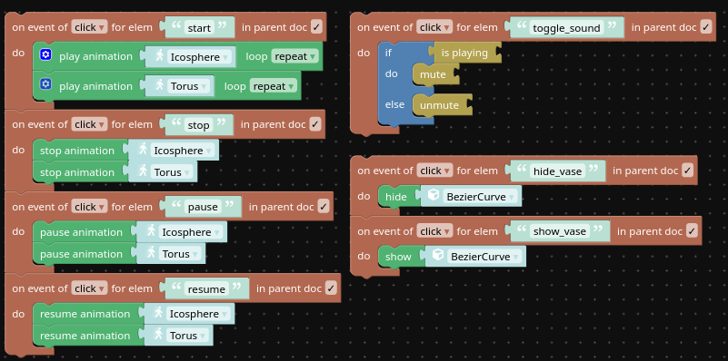

# Вариант: 14

# Цель работы:

Разработать интерфейс для управления анимацией 3D объектов Web-приложения в формате HTML-страницы с применением таблиц стилей (CSS) при описании внешнего вида документа.

# Разработка HTML-интерфейса

Сперва был написан основной код разметки

 

После чего к коду были добавлены стили

Получился такой интерфейс

# Описание логики взаимодействия с объектами сцены

К элементам управления, через пазлы были добавлены обработчики нажатий с соответствующей логикой

# Характеристики созданного интерактивного 3D приложения. Способ публикации в интернет

Приложение имеет имя lr_5 и весит 7.4Мб, чтобы опубликовать это приложение в интернет, необходимо нажать на кнопку с изображением стрелки, направленной вверх

После чего можно будет отправить прямую ссылку на проект другим людям или вставить в html код страницы при помощи предоставленного кода с iframe элементом

# Выводы 

Разработан интерфейс для управления анимацией 3D объектов Web-приложения в формате HTML-страницы с применением таблиц стилей (CSS) при описании внешнего вида документа.